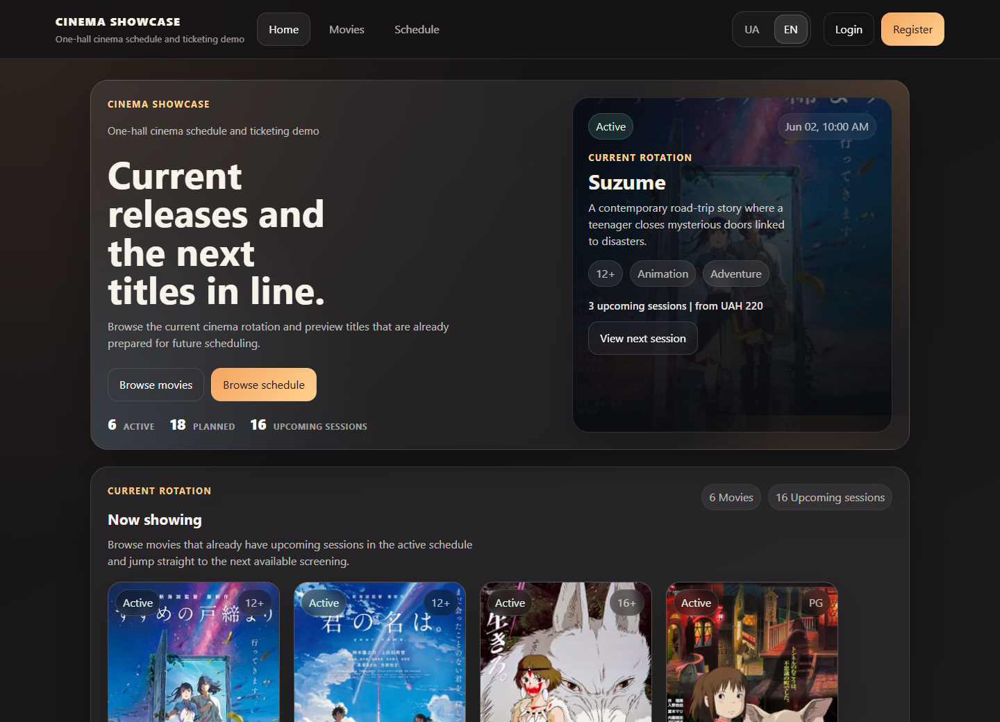
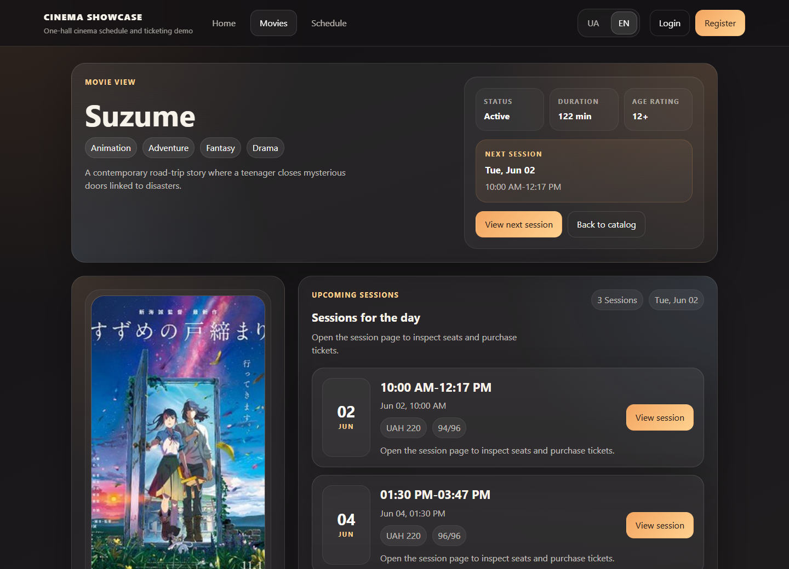
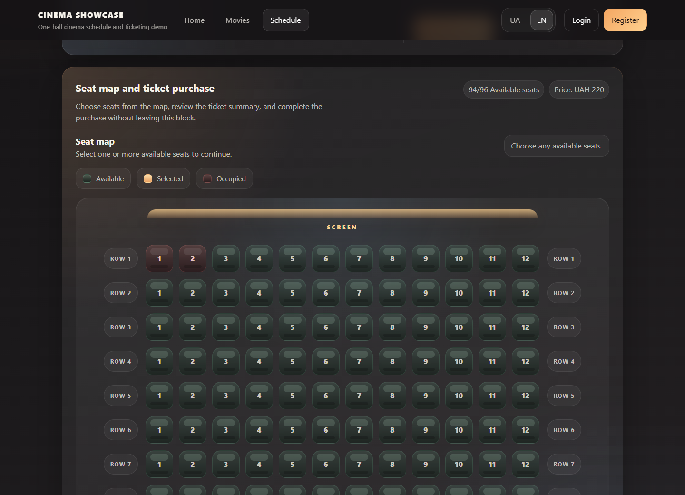
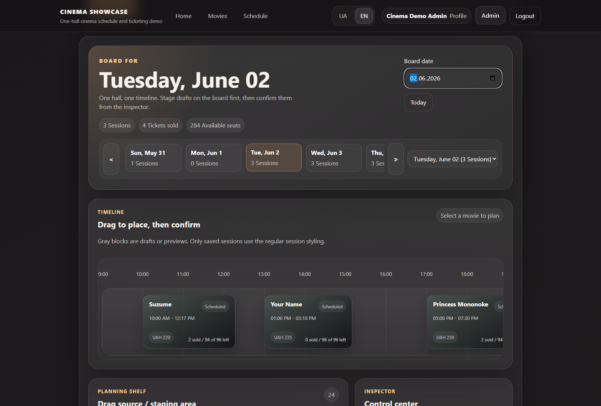
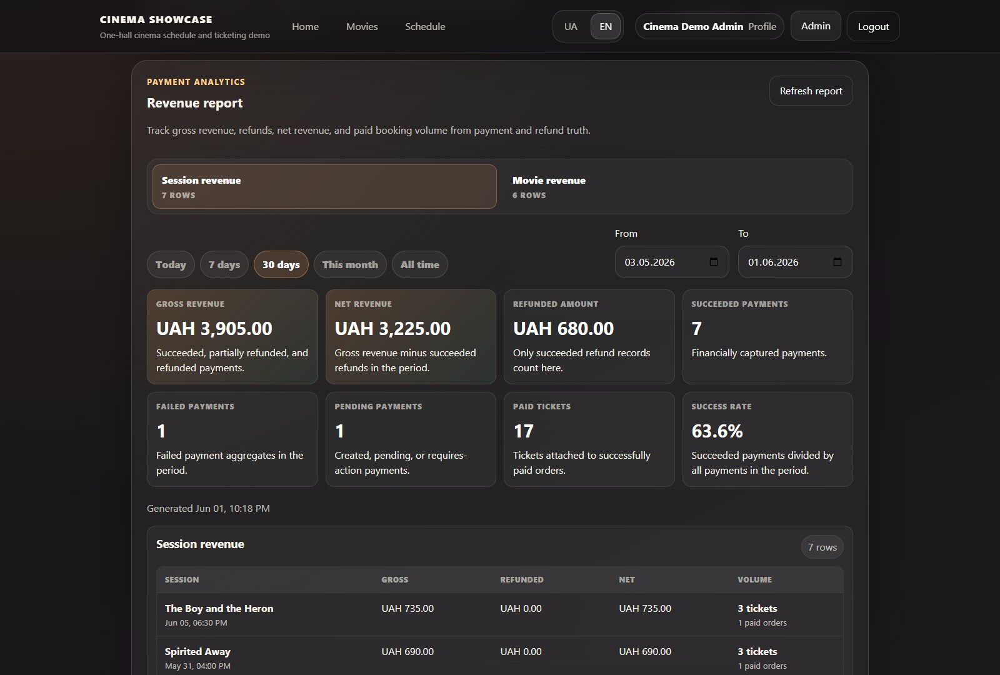
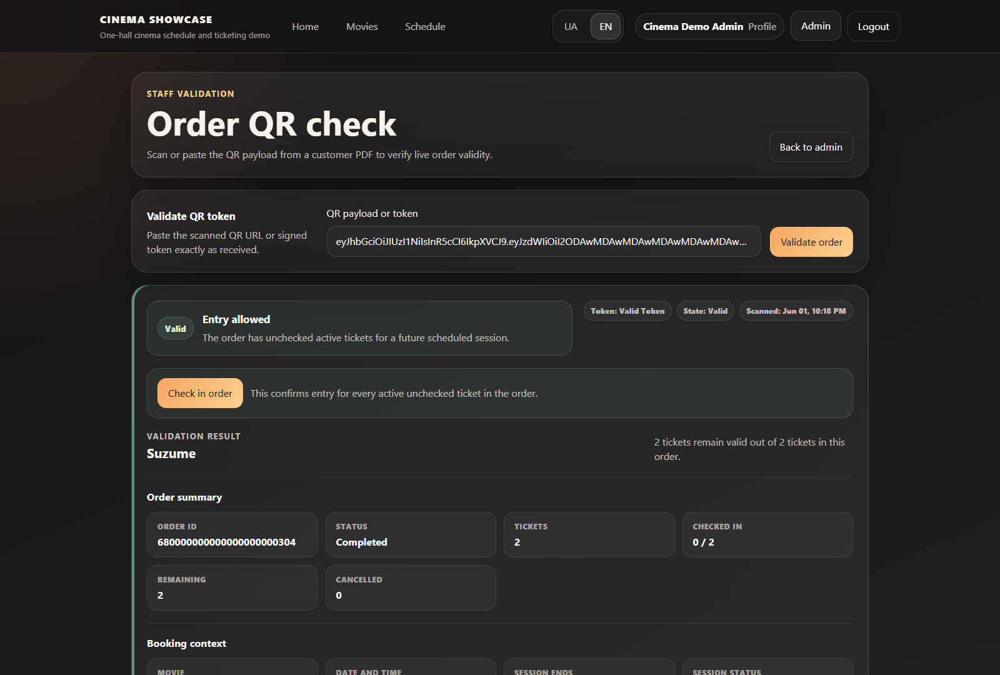

# Cinema Showcase

<p align="left">
  
  
  
  
  
</p>

Cinema Showcase is an academic full-stack web application for operating a small one-hall cinema. It models the practical workflow of a cinema website: customers browse movies and sessions, reserve seats, initiate payment, receive order/ticket documents, and staff validate entry at the hall.

The repository contains a FastAPI backend, a React/Vite frontend, MongoDB persistence, Docker development infrastructure, deterministic demo data, and a backend test suite with unit and integration coverage.

## Quick Links

- [Project overview](#project-overview)
- [Tech stack](#tech-stack)
- [Setup and run](#setup-and-run)
- [Demo seed and demo data](#demo-seed-and-demo-data)
- [Testing](#testing)
- [Contributing](CONTRIBUTING.md)
- [License](#license)

## Project Status

Cinema Showcase is a portfolio-ready coursework/demo project. It is not wired to real payment acquiring or production hosting, but it is structured to demonstrate real full-stack architecture, transaction-safe booking flows, admin operations, and defensible backend boundaries.

## Why This Project Stands Out

- Multi-ticket order and reservation model with temporary seat holds, expiry, payment finalization, cancellation, and refund paths.
- MongoDB replica-set transaction support for booking, payment, cancellation, and expiry flows.
- Admin tooling for schedule planning, attendance reporting, payment inspection, refunds, and QR/order validation.
- Provider-style fake payment workflow with signed webhooks, deduplication, audit events, and seeded payment states for demos.
- Deterministic demo data that covers successful, pending, failed, cancelled, expired, refunded, and partially refunded workflows.

## Demo Preview

Real screenshots from the seeded local demo data:

### Home Page



### Movie Details



### Session Seat Map



### Admin Chronoboard



### Admin Payment Analytics



### Staff Order Validation



## Project Overview

The application is built around a one-hall cinema with a configurable seat grid. The default hall configuration is 8 rows with 12 seats per row, for 96 seats per session.

Customers can:

- create an account and sign in with JWT-based authentication;
- browse an active movie catalog with localized Ukrainian/English movie fields;
- view upcoming sessions and live seat availability;
- select one or more seats for a session;
- create an order reservation that temporarily holds the selected seats;
- initiate or retry payment for a pending order;
- view profile data, order history, ticket status, and order details;
- download a PDF for a paid order;
- cancel eligible tickets before the session starts;
- deactivate their account.

Administrators can:

- manage movies, localized movie text, genres, ratings, posters, and movie lifecycle state;
- create, batch-create, update, cancel, and safely delete sessions;
- inspect tickets, users, bookings, payment state, and attendance;
- validate order QR tokens and check customers in;
- export attendance details to PDF from the admin UI;
- inspect payment attempts, webhook history, refunds, and payment revenue summaries;
- issue full or partial refunds through the implemented fake payment provider.

The project is demo-oriented, but the backend is intentionally structured with validators, indexes, transactions, service boundaries, and provider abstractions so it can be defended as a real application architecture rather than a static prototype.

## Implemented Features

### Authentication And Accounts

- User registration and login.
- JWT access and refresh tokens signed with `python-jose`.
- Role-based access control with `user` and `admin` roles.
- Admin access guarded on backend routes through authenticated admin dependencies.
- Frontend token storage, Authorization header injection, and automatic access-token refresh after `401` responses.
- Profile read/update endpoints.
- Account deactivation through a soft `is_active = false` update.
- Inactive accounts are rejected by protected routes and refresh flow.

### Movie Catalog

- Public movie listing and movie details.
- Public catalog exposes active movies.
- Admin listing includes planned, active, and deactivated movies.
- Localized movie model: `title` and `description` are structured localized objects with Ukrainian and English values.
- Genre normalization against a backend genre registry.
- Poster support through either external/root-relative poster URLs or uploaded poster files served from the backend media directory.
- Safe movie deactivation and guarded deletion:
  - a movie cannot be deactivated while it has future scheduled sessions;
  - a movie can only be deleted when no session has ever referenced it.

### Schedule And Seat Selection

- Public schedule browsing for future scheduled sessions.
- Session details include movie data, date/time, price, and available seats.
- Seat map endpoint returns row/seat availability.
- One-hall capacity is derived from `HALL_ROWS_COUNT * HALL_SEATS_PER_ROW`.
- Backend startup creates indexes that prevent two active tickets from owning the same seat in the same session.
- Session status synchronization is request-driven:
  - past scheduled sessions can be marked completed by service logic;
  - movies can move between planned, active, and deactivated based on future scheduled sessions.

### Orders, Reservations, And Tickets

- The current purchase flow creates a pending payment reservation, not an immediately completed ticket purchase.
- `POST /api/v1/orders/purchase`:
  - validates session state and future start time;
  - validates seat bounds and duplicate seat input;
  - expires stale reservations for the session;
  - creates an `Order` with status `pending_payment`;
  - creates reserved `Ticket` records;
  - decrements available seats in the same MongoDB transaction.
- Reservations expire after `RESERVATION_HOLD_MINUTES`.
- Expiry restores seats and marks reserved tickets/orders/payments as expired where applicable.
- Payment success finalizes an order by converting reserved tickets to purchased tickets and moving the order to `completed`.
- Users can inspect order details and order history.
- Ticket cancellation is supported for eligible tickets before the session starts.
- Order cancellation exists at the API/service level and cancels active tickets in the order when rules allow it.
- Customer cancellation restores seats; customer refunds are requested explicitly afterward so the user can choose a ticket-level partial refund or a full cancelled-order refund.

### Payment Subsystem

Payment functionality is implemented, but only with the local fake provider. There is no real external acquiring integration and no real card collection.

Implemented payment behavior:

- Provider-neutral payment domain with:
  - `Payment`;
  - `PaymentAttempt`;
  - `PaymentWebhookEvent`;
  - `Refund`;
  - `PaymentAuditEvent`.
- Fake provider adapter under `backend/app/payments/providers/fake.py`.
- Payment initiation for pending orders.
- Payment retry while the reservation is still active.
- Payment status reads for users/admins.
- Signed webhook endpoint for provider events.
- Webhook deduplication by provider event id.
- HMAC signature verification for fake-provider webhooks.
- Payment success finalizes the reserved order.
- Payment failure, cancellation, or expiry releases the reservation and restores seats.
- Local fake-provider page for demos with success, failed, cancelled, and keep-pending actions.
- Demo fake-provider actions are sent through the signed webhook processing lifecycle; the frontend does not mark payments paid by itself.
- Admin payment workspace with filters, payment details, attempts, webhooks, refunds, and revenue summary.
- Full and partial refund support through the fake provider.
- Customer refund request endpoint for cancelled tickets/orders. Ticket-level requests are implemented as partial refunds against the order payment, not as ticket-owned money.
- Safe payload snapshot validation/redaction to avoid storing sensitive provider data.

Important demo behavior: the fake provider redirects to the local frontend fake payment page at `/payment/fake/{paymentId}`. Fresh local orders still become completed only when the backend processes a matching provider-style webhook; the demo buttons generate those fake-provider events for controlled presentations. The seeded demo data also includes successful, pending, failed, cancelled, expired, refunded, and partially refunded payment states for demonstration.

### PDF And QR Validation

- Backend order PDF generation uses `reportlab`.
- Paid orders can be exported as PDF.
- Order PDFs include a signed order-validation token encoded as a QR code.
- QR generation uses `qrcode[pil]`.
- Order validation tokens are JWTs signed with the backend JWT secret.
- Admin/staff validation page accepts either a raw token or a scanned validation URL.
- Validation checks live order/session/ticket state, not only token syntax.
- Admins can check in all active unchecked tickets in an order.
- Checked-in tickets cannot be checked in again and are reported as already used.

### Admin Management

- Movie CRUD-style management with lifecycle protections.
- Poster upload/removal for movies.
- Session create, batch create, update, cancel, and guarded delete.
- Session validation includes:
  - future start time;
  - configured business hours;
  - movie duration fit;
  - no overlap with existing non-cancelled sessions in the single hall;
  - no editing of sessions that already have active reserved/purchased tickets.
- Admin schedule management includes a chronoboard-style one-hall planning surface for scanning the timeline and managing sessions.
- Ticket and user inspection.
- Bookings analytics grouped by order/session/movie/customer context.
- Attendance reporting and per-session attendance detail.
- Admin order validation and check-in workflow.
- Payment analytics and refunds.

### Reporting And Analytics

- Attendance report endpoint for admins.
- Per-session attendance details with:
  - sold/available/total seat counts;
  - attendance rate;
  - checked-in and unchecked active tickets;
  - cancelled ticket context;
  - buyer/order/ticket details;
  - generated seat map.
- Frontend admin reporting tabs for attendance, bookings, and account snapshots.
- Frontend attendance detail PDF export uses `jspdf` and an embedded Noto Sans font.

## Future Work

The following are not implemented as production features and should not be presented as current behavior:

- real payment provider integration;
- real hosted checkout or card input UI;
- email delivery for receipts or account events;
- broader frontend automated test coverage;
- background worker or scheduler for expiry/session completion;
- live seat updates over WebSocket/SSE;
- production object storage for uploaded posters/PDFs;
- production deployment configuration beyond the development Docker Compose setup.

## Tech Stack

### Backend

- Python 3.12
- FastAPI
- Pydantic v2 and `pydantic-settings`
- Motor async MongoDB driver
- PyMongo transaction/index/validator primitives
- MongoDB replica-set transactions
- `python-jose` for JWTs
- `passlib` with bcrypt for password hashing
- `reportlab` for order PDFs
- `qrcode[pil]` for QR image generation
- `pytest`, `pytest-asyncio`, and `pytest-cov`

### Frontend

- React 18
- Vite
- TypeScript
- React Router
- Axios
- i18next / react-i18next
- jsPDF for frontend attendance exports
- CSS files organized by pages/widgets/features

### Database And Runtime

- MongoDB 7
- Required replica set named `rs0` for transaction support
- Docker Compose development environment
- Local media directory for uploaded posters

## Project Structure

```text
.
|-- backend/
|   |-- app/
|   |   |-- api/
|   |   |   |-- routers/              # FastAPI route modules
|   |   |   `-- dependencies/         # Auth, pagination, service dependencies
|   |   |-- builders/                 # PDF/report builders
|   |   |-- commands/                 # Transactional write use cases
|   |   |-- core/                     # Config, constants, logging, exceptions
|   |   |-- db/                       # Mongo connection, indexes, validators, transactions
|   |   |-- middleware/               # Request logging middleware
|   |   |-- models/                   # Typed document shapes
|   |   |-- observers/                # In-process domain event hooks
|   |   |-- payments/                 # Provider abstractions and fake provider
|   |   |-- repositories/             # Mongo collection access
|   |   |-- schemas/                  # Pydantic API/domain schemas
|   |   |-- security/                 # JWT, hashing, order validation tokens
|   |   |-- seeds/                    # Deterministic demo dataset and seed command
|   |   |-- services/                 # Application services
|   |   |-- tests/                    # Backend tests
|   |   `-- main.py                   # FastAPI app factory/configuration
|   |-- media/                        # Runtime uploaded media, ignored in git
|   |-- requirements.txt
|   |-- pyproject.toml
|   `-- Dockerfile
|-- frontend/
|   |-- public/
|   |   `-- demo-posters/             # Static demo poster assets
|   |-- src/
|   |   |-- api/                      # Axios client and API modules
|   |   |-- app/                      # App shell
|   |   |-- assets/                   # Frontend assets/fonts
|   |   |-- contexts/                 # Auth context
|   |   |-- features/                 # Feature helpers such as PDF export
|   |   |-- pages/                    # Route pages
|   |   |-- router/                   # React Router configuration
|   |   |-- shared/                   # Shared UI, formatting, localization helpers
|   |   |-- types/                    # Frontend domain types
|   |   `-- widgets/                  # Larger UI widgets
|   |-- package.json
|   `-- Dockerfile
|-- docker/
|   `-- mongodb/
|       `-- init-replica.sh           # Initializes rs0 in Docker Compose
|-- docker-compose.yml
`-- README.md
```

## Domain Model And Architecture

### Main Domain Entities

- `User`: account identity, email, password hash, role, active flag, timestamps.
- `Movie`: localized title/description, duration, poster data, age rating, normalized genres, lifecycle status.
- `Session`: one scheduled showing for one movie in the single hall, with start/end time, price, capacity, available seats, and status.
- `Order`: customer-level aggregate for one session purchase/reservation. Tracks status, totals, ticket counts, expiry, payment ids, and timestamps.
- `Ticket`: one seat in one session. Tracks reserved/purchased/cancelled/expired state, reservation expiry, check-in timestamp, and order/user/session relation.
- `Payment`: provider-neutral payment record attached to an order.
- `PaymentAttempt`: each provider initiation/retry attempt.
- `PaymentWebhookEvent`: stored webhook event with verification and processing state.
- `Refund`: full or partial refund record attached to a payment/order.
- `PaymentAuditEvent`: payment/refund status-change audit trail.
- `AttendanceReport`: derived reporting model for admin dashboards and session details.

### Architecture Patterns

- API routers stay thin and delegate business work to services.
- Services coordinate repositories, commands, providers, and builders.
- Repositories isolate MongoDB collection operations.
- Commands implement high-risk transactional write flows such as reservation creation, order finalization, reservation expiry, ticket cancellation, order cancellation, and session cancellation.
- MongoDB validators and indexes are applied on startup.
- Transaction helper wraps Motor sessions with retry behavior for transient transaction errors and unknown commit results.
- Payment providers are abstracted behind a provider interface. The current configured provider is `fake`.
- Report/PDF generation is separated into builders/features rather than embedded directly in route handlers.
- Domain event hooks exist for ticket reserved/purchased/cancelled events, currently as in-process observer infrastructure.

### MongoDB Transaction Requirements

The backend intentionally requires a MongoDB replica set. Startup checks MongoDB `hello` output and rejects standalone MongoDB because booking, payment finalization, cancellation, and expiry flows rely on multi-document transactions.

The default local connection string is:

```text
mongodb://localhost:27017/?replicaSet=rs0&directConnection=true
```

In Docker Compose, backend containers use:

```text
mongodb://mongodb:27017/?replicaSet=rs0&directConnection=true
```

## API And Swagger

When the backend is running:

- Swagger UI: `http://localhost:8000/docs`
- ReDoc: `http://localhost:8000/redoc`
- OpenAPI JSON: `http://localhost:8000/openapi.json`
- Health endpoint: `http://localhost:8000/api/v1/health`

Swagger is useful during demo/defense for showing:

- route grouping by feature;
- request and response schemas;
- validation rules;
- admin-only endpoints;
- payment/refund/webhook schemas;
- attendance and QR validation responses.

Auth notes:

- JSON login is available at `POST /api/v1/auth/login`.
- Token refresh is available at `POST /api/v1/auth/refresh`.
- `POST /api/v1/auth/token` exists as a Swagger/OAuth2-compatible token helper.
- Protected endpoints require `Authorization: Bearer <access_token>`.
- Admin endpoints require an authenticated user with role `admin`.

## Setup And Run

### Prerequisites

Recommended:

- Docker Desktop with Docker Compose
- Node.js 20 or newer
- npm 10 or newer
- Python 3.12

For local backend execution without Docker, you also need a MongoDB replica set. A standalone MongoDB server is not enough for this project.

### Environment Files

Create local environment files from the examples:

```powershell
copy backend\.env.example backend\.env
copy frontend\.env.example frontend\.env
```

On macOS/Linux:

```bash
cp backend/.env.example backend/.env
cp frontend/.env.example frontend/.env
```

Important backend environment variables:

- `MONGODB_URI`
- `MONGODB_DB_NAME`
- `JWT_SECRET_KEY`
- `ADMIN_EMAILS`
- `FRONTEND_BASE_URL`
- `HALL_ROWS_COUNT`
- `HALL_SEATS_PER_ROW`
- `RESERVATION_HOLD_MINUTES`
- `PAYMENT_PROVIDER`
- `PAYMENT_WEBHOOK_SECRET`
- `LOG_LEVEL`
- `LOG_FORMAT`
- `LOG_FILE_ENABLED`
- `APP_LOG_FILE`
- `PAYMENTS_LOG_FILE`
- `AUDIT_LOG_FILE`
- `LOG_ROTATION_MAX_BYTES`
- `LOG_ROTATION_BACKUP_COUNT`

Important frontend environment variable:

- `VITE_API_BASE_URL`, defaulting to `http://localhost:8000/api/v1` in the example file.

### Backend Logging

Backend logging is configured in `app.core.logging` and enabled from the FastAPI lifespan startup.

Default file outputs:

- `backend/logs/app.log`: regular application and request logs.
- `backend/logs/payments.log`: payment, refund, and webhook operational events.
- `backend/logs/audit.log`: payment audit events and important admin actions.

The dedicated payment and audit loggers do not propagate into `app.log`; use those files for operational review of money movement and protected admin actions.

All three files use `RotatingFileHandler`. The defaults are `10 MB` per file and `5` retained backups. Override paths and rotation through:

- `LOG_FILE_ENABLED`
- `LOG_FILE_LEVEL`
- `PAYMENT_LOG_LEVEL`
- `AUDIT_LOG_LEVEL`
- `APP_LOG_FILE`
- `PAYMENTS_LOG_FILE`
- `AUDIT_LOG_FILE`
- `LOG_ROTATION_MAX_BYTES`
- `LOG_ROTATION_BACKUP_COUNT`

Each record includes timestamp, level, logger name, `request_id`, message, and safe extra fields. `RequestLoggingMiddleware` reads `X-Request-ID`, `X-Correlation-ID`, or `Correlation-ID`; if none is provided, it generates a request id and returns it as `X-Request-ID`.

Timestamps are emitted in UTC with a stable ISO-8601 `Z` suffix. Repeated logging setup is protected from duplicate handlers by non-incremental `dictConfig` reconfiguration guarded by a process-local lock.

The default `LOG_FORMAT=text` keeps readable log lines. Set `LOG_FORMAT=json` for newline-delimited JSON records with `timestamp`, `level`, `logger`, `request_id`, `message`, and safe `metadata`.

The logging formatter redacts sensitive keys and string patterns, including tokens, authorization headers, cookies, webhook signatures, provider secrets, API keys, JWT/secrets, and card/PAN/CVV-style fields. Runtime logs are ignored by git via `backend/logs/`.

Logging hardening is covered by `pytest app/tests/test_logging.py app/tests/test_payment_domain.py -q`, including duplicate-handler protection, UTC timestamps, JSON mode, rotation, and payment-webhook secret leak checks.

### Run With Docker Compose

Docker Compose is the recommended development path because it starts MongoDB as a replica set and runs the init container that configures `rs0`.

```powershell
docker compose up --build
```

Detached mode:

```powershell
docker compose up -d --build mongodb mongodb-init-replica backend frontend
docker compose ps
```

Application URLs:

- Frontend: `http://localhost:5173`
- Backend API base: `http://localhost:8000/api/v1`
- Swagger: `http://localhost:8000/docs`

Stop services:

```powershell
docker compose down
```

The Compose setup includes:

- `mongodb`: MongoDB 7 started with `--replSet rs0`;
- `mongodb-init-replica`: one-shot replica-set initialization;
- `backend`: FastAPI app with reload enabled;
- `frontend`: Vite dev server.

### Run Backend Locally

Use this path only if a MongoDB replica set is already running and reachable through `MONGODB_URI`.

```powershell
cd backend
python -m venv .venv
.\.venv\Scripts\Activate.ps1
python -m pip install -r requirements.txt
uvicorn app.main:app --reload
```

The backend runs on `http://localhost:8000` by default.

If dependency behavior looks strange, use the virtual environment and pinned `requirements.txt`. Running with a globally installed Python package set can produce unrelated dependency conflicts, especially around bcrypt/passlib.

### Run Frontend Locally

```powershell
cd frontend
npm ci
npm run dev
```

The Vite dev server runs on `http://localhost:5173` by default.

Production build check:

```powershell
cd frontend
npm run build
```

Preview the production build:

```powershell
npm run preview
```

### Manual MongoDB Replica Set

The Docker setup is simpler, but a manual local replica set can be used. The important requirement is that MongoDB is initialized as `rs0` and the backend URI includes `replicaSet=rs0`.

Example shape:

```powershell
mongod --replSet rs0 --bind_ip localhost,127.0.0.1 --dbpath <path-to-data-directory>
mongosh --eval "rs.initiate({_id:'rs0',members:[{_id:0,host:'127.0.0.1:27017'}]})"
```

Then configure:

```text
MONGODB_URI=mongodb://localhost:27017/?replicaSet=rs0&directConnection=true
```

## Demo Seed And Demo Data

The backend contains a deterministic seed command:

```powershell
cd backend
python -m app.seeds.demo_seed --reset
```

With Docker:

```powershell
docker compose exec -T backend python -m app.seeds.demo_seed --reset
```

`--reset` clears the configured domain collections before inserting the demo dataset. Use it only against a development/demo database.

Without `--reset`, the command removes the known deterministic seed object ids and reinserts them. This is useful when you want to refresh demo content without clearing unrelated records.

Current deterministic seed contents:

- 5 users;
- 30 movies;
- 20 sessions;
- 11 orders;
- 24 tickets;
- 11 payments;
- 11 payment attempts;
- 2 refunds;
- 12 payment webhook events;
- 13 payment audit events.

Demo state coverage:

- movies: active, planned, and deactivated;
- sessions: scheduled, completed, and cancelled;
- orders: completed, partially cancelled, pending payment, cancelled, payment cancelled, expired, and payment failed;
- tickets: purchased, reserved, cancelled, and expired;
- payments: succeeded, pending, failed, cancelled, expired, refunded, and partially refunded.

Demo credentials:

| Role | Email | Password |
| --- | --- | --- |
| Admin | `admin@cinema-showcase.dev` | `CinemaDemo123!` |
| User | `chihiro@cinema-showcase.dev` | `CinemaDemo123!` |
| User | `taki@cinema-showcase.dev` | `CinemaDemo123!` |
| User | `suzu@cinema-showcase.dev` | `CinemaDemo123!` |
| User | `ashitaka@cinema-showcase.dev` | `CinemaDemo123!` |

The seed is useful for demos because it includes active upcoming bookings, historical bookings, QR/check-in states, failed payment paths, pending reservation state, refund state, cancelled sessions, and attendance/reporting examples.

## Testing

### Backend Tests

The backend test suite lives under `backend/app/tests`.

Recommended full path with Docker-backed MongoDB replica set:

```powershell
docker compose up -d mongodb mongodb-init-replica backend
docker compose exec -T -e TEST_MONGODB_URI="mongodb://mongodb:27017/?replicaSet=rs0&directConnection=true" -e TEST_MONGODB_DB_NAME="cinema_showcase_test" backend pytest app/tests -q
```

Why this is recommended:

- integration tests require MongoDB transactions;
- transactions require a replica set;
- inside the backend container, `127.0.0.1` is the backend container itself, so `TEST_MONGODB_URI` should point to `mongodb`;
- the test harness refuses unsafe database names such as the default development database.

Local backend test run:

```powershell
cd backend
.\.venv\Scripts\pytest.exe app\tests -q
```

If no local MongoDB replica set is reachable, integration tests are skipped by the test harness. Unit/schema/provider tests can still run.

Run only integration tests:

```powershell
docker compose exec -T -e TEST_MONGODB_URI="mongodb://mongodb:27017/?replicaSet=rs0&directConnection=true" -e TEST_MONGODB_DB_NAME="cinema_showcase_test" backend pytest app/tests/integration -q
```

Run payment-focused tests:

```powershell
docker compose exec -T -e TEST_MONGODB_URI="mongodb://mongodb:27017/?replicaSet=rs0&directConnection=true" -e TEST_MONGODB_DB_NAME="cinema_showcase_test" backend pytest app/tests/test_payment_domain.py app/tests/test_payment_providers.py app/tests/test_payments_api.py app/tests/integration/test_payments_api.py -q
```

Use `-o addopts=` when you want a quick run without the default coverage settings:

```powershell
pytest app/tests/test_payment_providers.py -o addopts= -q
```

### Frontend Checks

Frontend checks are configured in `frontend/package.json`.

```powershell
cd frontend
npm test
npm run build
```

The current frontend test coverage is lightweight, so the production build remains the main frontend validation step.

## Coverage

Backend coverage is configured in `backend/pyproject.toml`.

The default pytest configuration enables:

- branch coverage;
- terminal missing-line report;
- XML report;
- HTML report.

Generate or refresh coverage:

```powershell
cd backend
.\.venv\Scripts\pytest.exe app\tests -q
```

Recommended Docker-backed coverage run:

```powershell
docker compose exec -T -e TEST_MONGODB_URI="mongodb://mongodb:27017/?replicaSet=rs0&directConnection=true" -e TEST_MONGODB_DB_NAME="cinema_showcase_test" backend pytest app/tests -q
```

Coverage outputs:

- terminal summary;
- `backend/coverage.xml`;
- `backend/htmlcov/index.html`.

Do not rely on a README-stored percentage during defense. Regenerate coverage from the current branch and environment, preferably with the Docker-backed replica-set test path so integration tests are included.

## Security And Operational Notes

- Passwords are hashed with passlib/bcrypt.
- Access and refresh JWTs include subject, email, role, token type, issued-at, expiry, and JWT id.
- Protected routes load the current user from the database, so deactivated users are blocked.
- Admin routes require the `admin` role.
- Request logging middleware is enabled.
- Logging utilities redact sensitive keys such as passwords, tokens, secrets, authorization headers, cookies, signatures, card/PAN/CVV-style fields, and provider secrets.
- Movie and session deletion is guarded to avoid deleting records that are already referenced by operational history.
- Movie deactivation is safer than deletion and is blocked while future sessions exist.
- MongoDB JSON schema validators and indexes are applied on startup.
- Ticket seat uniqueness is enforced with a partial unique index for active reserved/purchased tickets.
- Booking, payment, cancellation, and expiry flows use MongoDB transactions and therefore require a replica set.
- Payment webhooks verify fake-provider HMAC signatures.
- Webhooks are persisted and deduplicated before processing.
- Payment/refund payload snapshots are schema-limited and reject sensitive fields.
- Uploaded poster files are type/size validated and stored under the backend media directory.

## Known Limitations

- The system models one hall only. There is no multi-hall or multi-branch concept.
- Docker Compose is a development/demo setup, not a production deployment.
- The only payment provider is the fake provider. There is no live acquiring provider or real card collection form.
- Fresh orders created through the UI remain pending until a provider webhook is processed; the local fake payment page can generate demo webhook outcomes.
- Reservation expiry and session status synchronization are request-driven. There is no background worker/scheduler.
- Frontend automated test coverage is currently lightweight.
- Uploaded media uses local filesystem storage.
- Order PDFs are generated on demand; they are not stored as durable documents.
- Attendance PDFs are generated client-side from the admin UI.
- There are no live seat updates over WebSocket/SSE.
- Stateless JWT refresh tokens are not backed by a server-side token revocation list.
- Some demo poster URLs point to external sources and can depend on network availability.

## License

This project is released under the MIT License. See [LICENSE](LICENSE).
